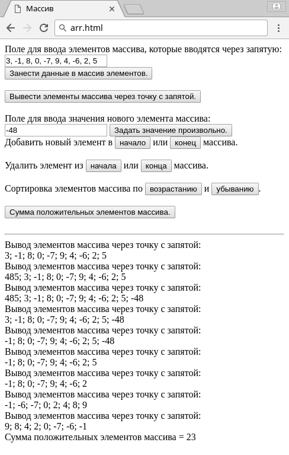
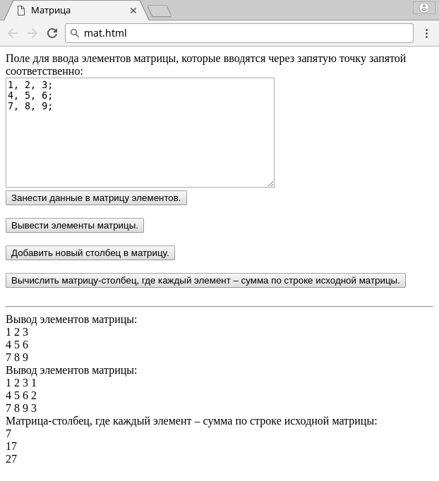

# Problem Statement

Создайте скрипты, выполняющие следующие операции. 

1. Страница содержит поле для ввода элементов массива, которые вводятся через запятую и кнопок выполняющих следующие действия: 
    1. Кнопка для занесения данных в массив элементов 
    2. Кнопка для вывода элементов массива через точку с запятой 
    3. Кнопки для добавления нового элемента в начало и конец массива и соответствующее поле для ввода значения нового элемента массива, а также кнопку, позволяющую задать это значение произвольно. 
    4. Кнопки для удаления элемента из начала и конца массива 
    5. Кнопка для сортировки элементов массива по возрастанию и убыванию 
    6. Кнопка для нахождения суммы положительных элементов массива 
2. Страница содержит поле для ввода элементов матрицы, которые вводятся через запятую точку запятой соответственно, а также кнопок выполняющих следующие действия: 
    1. Кнопка для занесения данных в матрицу элементов 
    2. Кнопка для вывода элементов матрицы; 
    3. Кнопки для добавления нового столбца в матрицу. 
    4. Кнопки для вычисления матрицы-столбца, где каждый элемент – сумма по строке исходной матрицы 

# Screenshots

<kbd></kbd>

<kbd></kbd>

# Links

- [JavaScript random generate 0 or 1 integer - Stack Overflow](https://stackoverflow.com/a/45136756/2289640)
