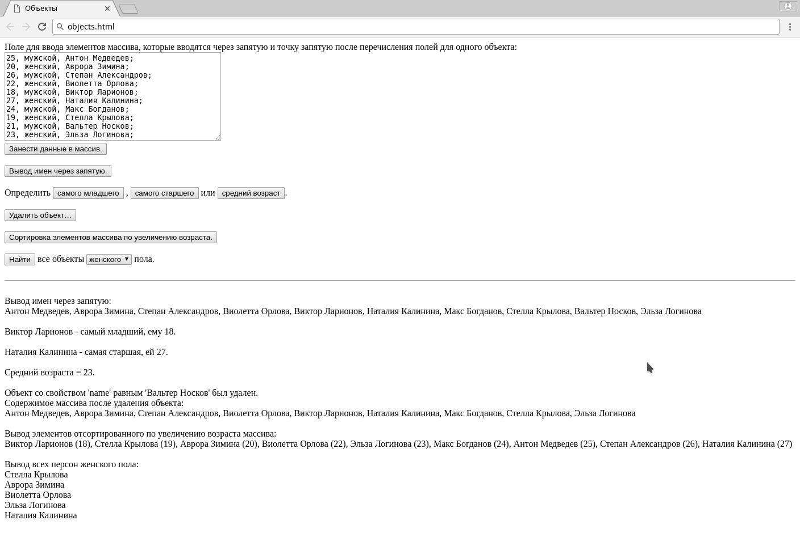

# Problem Statement

Создайте массив объектов с 3 полями (возраст, пол, имя).

Организуйте следующий функционал: 

Страница содержит:

1. поле для ввода элементов массива, которые вводятся через запятую и точку запятую после перечисления полей для одного объекта 
2. кнопок выполняющих следующие действия: 
    1. Кнопка для занесения данных в массив 
    2. Кнопка для имен через запятую 
    3. Кнопки для определения самого старого и самого молодого. 
    4. Кнопки для удаления элемента 
    5. Кнопка для сортировки элементов массива по увеличению возраста 
    6. Кнопка для нахождения всех объектов одного пола 
    7. Кнопка для нахождения среднего возраста 

# Screenshot

<kbd></kbd>

# Links

- [syntax - How do I convert a float number to a whole number in JavaScript? - Stack Overflow](https://stackoverflow.com/a/596503/2289640)
- [html select - Get selected value in dropdown list using JavaScript? - Stack Overflow](https://stackoverflow.com/a/1085810/2289640)
