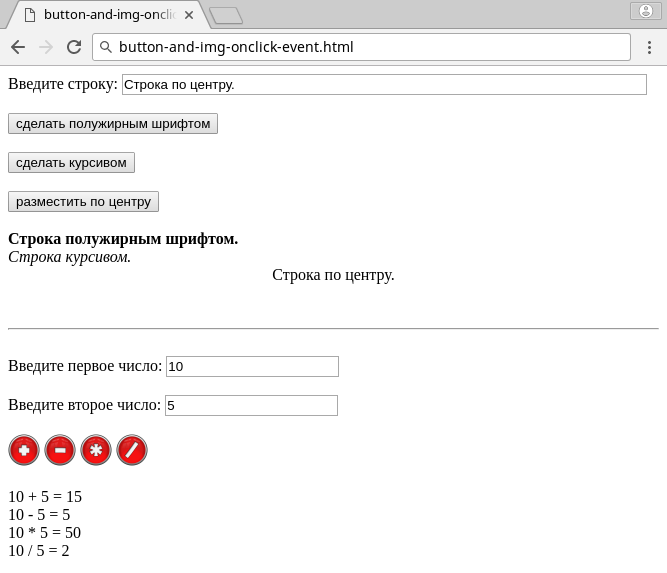

# Problem Statement

Cоздайте на странице три кнопки, при нажатии на которые выполняется скрипты, записывающие на ней следующие 3 строчки: 

* первая будет полужирным шрифтом;
* вторая курсивом;
* третья – размещена по центру.

Кроме того, создайте четыре картинки, при нажатии на которые выполняется соответственно:

* сложение;
* вычитание;
* умножение;
* деление 2 чисел.

# Screenshots

<kbd></kbd>
