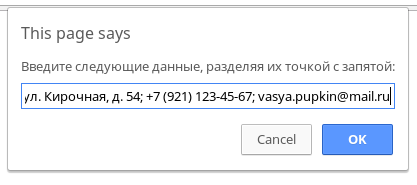
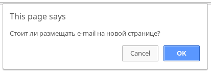
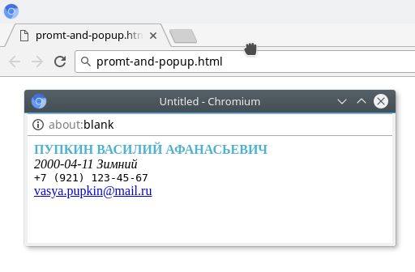

# Problem Statement

Создайте страницу, выполняющие следующие операции.

1. Страница при загрузке выводит диалоговое окно где просит внести следующие данные, разделяя их точкой с запятой: фамилия, имя, отчество, дату рождения, адрес проживания, телефон, e-mail.
2. Полученные данные показываются в новом окне следующим образом: 
    1. Фамилия Имя Отчество – прописными полужирными буквами нестандартного цвета; 
    2. Дата рождения – курсивом, причем рядом дописывается фраза вида «Летний – для рожденных в июне, июле, августе» и т.п. 
    3. Номер телефона – машинописным шрифтом 
    4. e-mail – запрашивается у пользователя стоит ли размещать данное поле на новой странице – при получении положительного ответа – он оформляется как гиперссылка. 
3. Новая страница не содержит заголовков и имеет только кнопку ее закрывающую. 

# Screenshots

<kbd></kbd>

<kbd></kbd>

<kbd></kbd>
